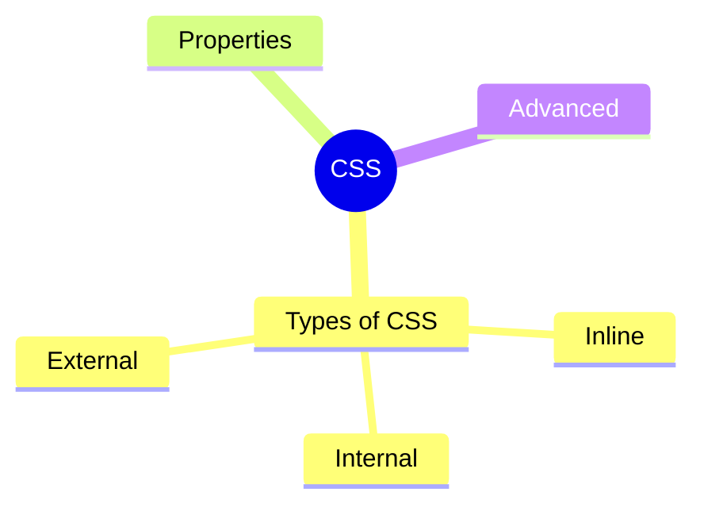

# CSS
## Types of CSS

**Inline CSS:** directly applied on the HTML elements and it is the most prioritize CSS. This will override any external or internal CSS.

**Internal CSS:** defined in the HTML head section inside of `<style>` tag to let the browser know where to look for the CSS.

**External CSS:** External CSS are defined in a separate file that contains only CSS properties, this is the recommended way to use CSS when you are working on projects. It is easy to maintain and multiple CSS files can be created and you can use them by importing it into your HTML document using HTML `<link>` tag.

## Properties
* Background
* Border
* Display
* Float
* Line Height
* Margin
* Opacity
* Overflow
* Padding
* Position
* Align
* White Space
* Width
* Height
* Outline
* Visibility
* Counter

## Advanced
* FlexBox
* Responsive Design
* @Media Query
* 2D Transforms
* 3D Transforms
* Pseudo Classes
* Animation
* Gradient
* Transition
* Tooltips
* Arrow
* Grid