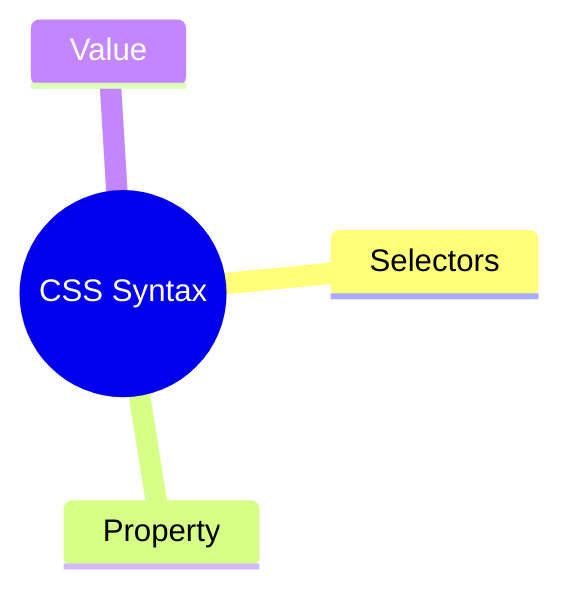

# CSS Syntax and Selectors
```css
selector {
    property: value;
}
```
## Property
💡An aspect or characteristic of an HTML element that can by styled or modified using CSS 💡 
## Value
💡Assigned to properties💡 
## Selectors - Many Different Kinds
💡  Used to select the HTML element or groups of elements you want to style elements that are selected by the selector are referred to as **subject of the selector.** 💡

### Universal
* denoted by an asterisk mark `*`
* special selector that matches all elements in an HTML document
* generally used to add a same length margin and padding to ALL elements in the document

```css
* {
   margin: 0;
   padding: 0;
}
```
### Element
* targets an HTML element, such as ```<h1>``` OR ```<p>``` tags
* used when we want to apply similar style to all the ```<p>``` OR ```<h1>``` tags in the document

```css
/* Sets text color of all p tags to green */
p {
   color: green;
}
/* Add underline to all h1 tags in document */
h1 {
   text-decoration-line: underline;
}
```
### Class
* targets an element with a specific value for its class attribute to style it
* a class in CSS is denoted by a period symbol `.`

```css
.sideDiv {
   text-decoration-line: underline;
}

.topDiv {
   color: green;
   font-size: 25px;
}
```
### Id
* targets single element with a particular value for `id attribute`
* an id in CSS is denoted by a `#` hash symbol
* same class can be applied to multiple elements, ***but an id is unique for an element.***

```css
#style-p {
   color: green;
   font-size: 25px;
} 

#style-h1 {
   text-decoration-line: underline;
   color: red;
}
```
### Attribute
* targets an element based on a specific attribute or attribute values on an element

```css
/* Style all anchor tag with target attribute */
a[target] {
   background-color: peachpuff;
}

/* Style all anchor tag that links to tutorialspoint */
a[href="https://www.tutorialspoint.com"] {
   background-color: peachpuff;
}
```
### Group
* apply the same style to multiple elements at a time
* name of elements can be separated by commas
* ***recommended as it keeps CSS concise and avoids redundancy.***

```css
/* Apply same background color for h1 and h2 */
h1, h2 {
   background-color: grey;
}
```
### Pseudo-class
* used to style a specific state of an element, such as `:hover`

```css
/* Change background color on hover */
a :hover {
   background-color: peachpuff; 
}
/* Change background color on clicking button */
button:active {
   background-color: yellow;
}
/* Change border color on focusing input */
input:focus {
   border-color: blue;
}
```
### Pseudo-element
* used to style a specific part of an element rather than the element itself
* examples being `p::before` and `p::after` (paragraph before and paragraph after)

```css
/* Define contents before paragraph */
a::before {
   content: " ";
}

/* Style first letter of paragraph */
p::first-letter {
   font-size: 2em;
}
```
### Descendant
* used to style all the tags which are child of a particular specified tag
* single space between parent and child element are used to mention as descendant

```css
div p {
   color: blue;
}
```
### Child
* used to target all the direct child of a particular element
* denoted by `>` symbol

```css
div > p {
   color: blue;
}
```
### Adjacent Sibling
* used to target an element that is immediately preceded by a specified element
* denoted using a `+` symbol

```css
h1 + p {
   margin-top: 0;
}
```
### General Sibling
* used to target all the elements that are preceded by a specified element
* denoted by a `~` symbol

```css
h1 ~ p {
   color: gray;
}
```